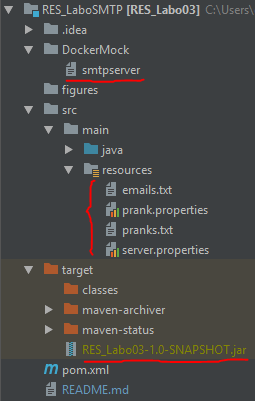
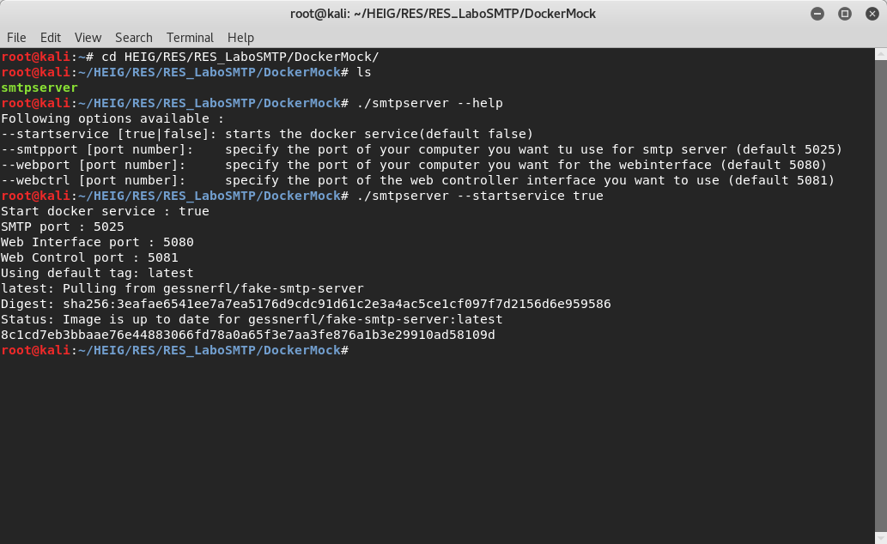
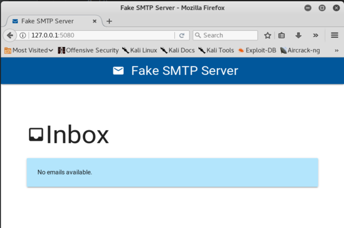
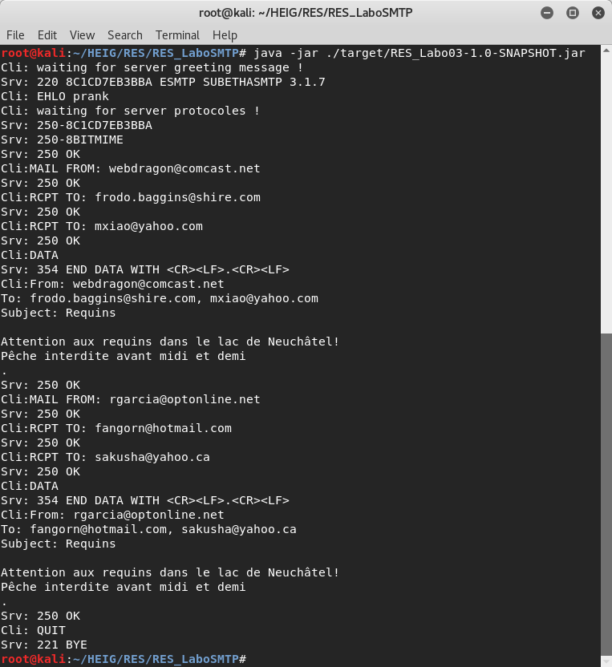

# Network Class - SMTP Spam Client Exercise

17 april 2018 - HEIG-VD 2nd year - by Adrien Allemand and Loyse Krug

## Intro

This is our school graded project featuring a SMTP Client designed to **send pranks to a list of email adresses**. 

## Objectives

In this lab, we were asked to develop a simple client application (TCP) in Java. This client application uses Socket API to prank a given SMTP server with forged e-mails. The main objectives were :

-   Become intimate with the **SMTP protocol** and learn the details and poetry of communicating with a **SMTP server**.
-   Approach the notion of **mock server**, in the hope of not being blacklisted by google itself !
-   Be witness to the supreme power and surprising ease of use of the **forged email client** we just gave birth to.
-   Apply the elegance of an **object-oriented model** to the solution we offer.

## Functional requirements

As stated by our professor at https://github.com/SoftEng-HEIGVD/Teaching-HEIGVD-RES-2018-Labo-SMTP

Your mission is to develop a client application that automatically plays pranks on a list of victims:

-   The user should be able to **define a list of victims** (concretely, you should be able to create a file containing a list of e-mail addresses).
-   The user should be able to **define how many groups of victims should be formed** in a given campaign. In every group of victims, there should be 1 sender and at least 2 recipients (i.e. the minimum size for a group is 3).
-   The user should be able to **define a list of e-mail messages**. When a prank is played on a group of victims, then one of these messages should be selected. **The mail should be sent to all group recipients, from the address of the group sender**. In other words, the recipient victims should be lead to believe that the sender victim has sent them.

## User Manual

The user manual is separated onto **two parts** : first we will explain how to easely **setup our mook server** with the help of docker, secondly we will go through the whole **configuration of the client** so you can benefit of **quality pranks**.

Here is a screenshot of the project structure where you can find the `smtpserver` script, the different configurations files in the ressource project and the executable .jar file.



### Setup the mook server

The setup of the mook server will be fairly easy as we use a docker container that is available on dockerhub. 

If you don't have a working install of docker please go to there website and install it : 
https://www.docker.com/community-edition

Now you have a running version of docker simply **run the script** named ` smtpstart` to launch the container. Please note that the `--webctrl ` argument is currently not working.




Please note that this script can take 5 arguments that are explained by writing `smtpstart --help`.

Feel free to assign different ports to the **SMTP** server and to the **WEB interface**. 

The script will automaticly download the container image if you don't have it then it will launch the container in detached mode. Note that the second step doesn't display anything in your terminal so please wait a moment  before you atempt to communicate with the server as it needs about 10 to 20 seconds to start.


You can test that the server is online by writing `telnet localhost 5025` in your terminal. Note that `5025` is the default port of the SMTP server and you may have to change it if you aren't using the default settings.

You can also open your favourit browser and go to http://localhost:5080 to withess the magnificence of your brand new WEB interface.



### Configure the client

The client configuration is a fairly easy thing thanks to the four configuration files :

#### *emails.txt*

Provide here the list of emails, one per row. Please be carefull not to leave any empty rows at the end of file.


#### *pranks.txt*

provide here the list of pranks, the delimiter character between two pranks is `==`


####*server.properties*  

This file is used to configure the client access to the server. Please note that if you are using the mook server container on linux you should enter `localhost` or `127.0.0.1` as server adress. `5025` is the default port for SMTP on our setup.

```java
host=192.168.99.100		// write your server adress here
port=5025			   // write your server smtp port here
```

####*pranks.properties*

This file configures the scale of your prank. If you provided a correct list of email and pranks, you can define here the size of a group (knowing that one of the adresses will be used as sender, the others as recivers) and the number of groups. Please note that the `numberOfGroups * groupSize` should not exceed the number of email adresses provided in the submentionned file, neither should the number of groups exceed the number of pranks provided in the list of pranks.

``` java
numberOfGroups=2	   // the number of groupes to prank
groupSize=3			   // the number of email adresses in one groupe
```

### Sending the pranks

Now that all your files are correctly configures simply run the jar file `java -jar ./target/RES_Labo03-1.0-SNAPSHOT.jar` from the RES_LaboSMTP folder and enjoy your prank!



